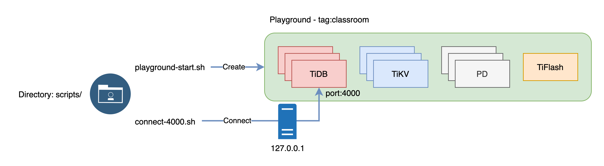

---
html:
    toc: true
---
# Creating a TiDB Cluster for Testing Purposes

### Overview
+ In these exercises, you create a TiDB cluster using either the TiDB Playground cluster on your laptop or the TiDB Cloud Serverless Tier. 
+ Both cluster types are designed for testing purposes and are helpful in enabling developers to better understand the TiDB interfaces at no additional cost.

### Notes
+ Some of the steps require that you type commands in two different terminal windows. You might find it convenient to launch two terminals and keep them open for the duration of the exercises.
+ Your environment may be different with these exercises, including but not limited to `IP`, `port`, `username`, `password` and `directory`.
+ The "`$`" in your terminal window is an OS prompt.
+ The "`tidb>`" or "`mysql>`" in your terminal window is SQL command prompt. 
+ These exercises can be run on a single machine, such as your laptop.
+ These exercises are designed for TiDB Playground cluster and TiDB Cloud Serverless Tier. It is crucial to note that the TiDB Playground cluster is not designed for production purposes.

### Assumptions
+ You are using macOS or Linux.
+ You have [Git command line client](https://git-scm.com/) installed.
+ You have [MySQL command line client](https://www.google.com/search?q=how+to+install+mysql+command+line+client) installed.

## Exercise 1: Creating a TiDB Playground Cluster Using `tiup playground` Command

  

### Overview
+ In this exercise, you create a TiDB cluster using `TiUP Playground`. 

### Duration
+ This exercise should take you approximately 10 minutes to complete.

### Tasks
1. Clone the workshop scripts repository.
2. Check and understand the demo scripts.
3. Create a TiDB Playground Cluster cluster.
4. Understand how to clean up TiUP Playground sandbox cluster.

### Solution
1. Clone the demo repository from `GitHub`, and receive the results shown.
      ```
      $ git clone https://github.com/pingcap/tidb-course-201-lab.git
      Cloning into 'tidb-course-201-lab'...
      ...
      ```

2. Change the current working directory to `scripts/` and verify two scripts.

      Change the working directory to `tidb-course-201-lab/scripts`.
      ```
      $ cd tidb-course-201-lab/scripts
      ```

      Review the script `playground-start.sh`, as running it will initiate a TiDB Playground cluster with 10 instances (3 PD server instances, 3 TiKV server instances, 2 TiDB server instances, and 1 TiFlash server instance). And, the directory tag for the Playground is `classroom`.
      ```
      $ cat playground-start.sh 
      #!/bin/bash
      ~/.tiup/bin/tiup playground v6.5.1 --tag classroom --db 2 --pd 3 --kv 3 --tiflash 1
      ```

      Review the script `playground-check.sh`, which displays the simplified status of instances for the TiDB Playground cluster.
      ```
      $ cat playground-check.sh
      #!/bin/bash
      ~/.tiup/bin/tiup playground display
      ```

3. Launch a TiDB Playground cluster and establish a connection to the TiDB server instance within the cluster.
  
      Download and install TiUP utility, and receive the results shown.
      ```
      $ curl --proto '=https' --tlsv1.2 -sSf https://tiup-mirrors.pingcap.com/install.sh | sh
      ...
      Shell profile:  /Users/username/.zshrc
      Installed path: /Users/username/.tiup/bin/tiup
      ===============================================
      Have a try:     tiup playground
      ===============================================
      ```

      Launch a local TiDB Playground cluster using the provided script and view the results. If you enter `Ctrl + C`, your Playground cluster will exit.
      ```
      $ ./playground-start.sh
      ...
      Connect TiDB:   mysql --host 127.0.0.1 --port 4000 -u root
      Connect TiDB:   mysql --host 127.0.0.1 --port 4001 -u root
      TiDB Dashboard: http://127.0.0.1:2379/dashboard
      Grafana:        http://127.0.0.1:51362
      ```

      Open a new terminal window to verify the status of the TiDB Playground cluster and display the resulting information.
      ```
      $ cd tidb-course-201-lab/scripts
      $ ./playground-check.sh
      tiup is checking updates for component playground ...
      Starting component `playground`: /Users/username/.tiup/components/playground/v1.11.0/tiup-playground display
      Pid    Role     Uptime
      ---    ----     ------
      11473  pd       3m4.584159125s
      11474  pd       3m4.563855125s
      11475  pd       3m4.550561s
      11476  tikv     3m3.560119667s
      11477  tikv     3m3.540240667s
      11478  tikv     3m3.52733175s
      11480  tidb     3m2.545229042s
      11481  tidb     3m2.533429333s
      11502  tiflash  2m54.914668834s
      ```

      Establish the connection to TiDB server instance on port 4000 as user `root`.

      ```
      $ cat connect-4000.sh 
      #!/bin/bash

      export MYSQL_PS1="tidb:4000> "

      mysql -h 127.0.0.1 -P 4000 -u root
      ```

      ```
      $ ./connect-4000.sh 
      ...
      Type 'help;' or '\h' for help. Type '\c' to clear the current input statement.

      tidb:4000>
      ```

      Run a simple query and exit, the result you obtain may differ from the output.
      ```sql
      SELECT TIDB_VERSION()\G
      EXIT;
      ```
      ```
      --------------
      SELECT TIDB_VERSION()
      --------------

      *************************** 1. row ***************************
      TIDB_VERSION(): Release Version: v6.5.1
      Edition: Community
      Git Commit Hash: 4084b077d615f9dc0a41cf2e30bc6e1a02332df2
      Git Branch: heads/refs/tags/v6.5.1
      UTC Build Time: 2023-03-07 16:04:47
      GoVersion: go1.19.5
      Race Enabled: false
      TiKV Min Version: 6.2.0-alpha
      Check Table Before Drop: false
      Store: tikv
      1 row in set (0.00 sec)

      tidb:4000>  EXIT;
      Writing history-file /Users/username/.mysql_history
      Bye
      ```

      Verify the `classroom` directory as it contains the complete file structure of your TiDB Playground cluster.
      ```
      $ find ~/.tiup/data/classroom -maxdepth 1
      /Users/username/.tiup/data/classroom
      /Users/username/.tiup/data/classroom/tikv-0
      /Users/username/.tiup/data/classroom/tikv-1
      /Users/username/.tiup/data/classroom/pd-1
      /Users/username/.tiup/data/classroom/pd-0
      /Users/username/.tiup/data/classroom/grafana
      /Users/username/.tiup/data/classroom/dsn
      /Users/username/.tiup/data/classroom/tiup_process_meta
      /Users/username/.tiup/data/classroom/tikv-2
      /Users/username/.tiup/data/classroom/pd-2
      /Users/username/.tiup/data/classroom/prometheus
      /Users/username/.tiup/data/classroom/port
      /Users/username/.tiup/data/classroom/tidb-1
      /Users/username/.tiup/data/classroom/tiflash-0
      /Users/username/.tiup/data/classroom/tidb-0
      ```

4. (optional) If you need to clean up the TiDB Playground cluster, you can do so.

      Go to the terminal where you previously ran `playground-start.sh`. The screen might look like this.
      ```
      ...
      To view the dashboard: http://127.0.0.1:2379/dashboard
      PD client endpoints: [127.0.0.1:2379 127.0.0.1:2382 127.0.0.1:2384]
      To view the Prometheus: http://127.0.0.1:9090
      To view the Grafana: http://127.0.0.1:3000
      ```

      Press `Ctrl-C` once to abort the TiDB Playground cluster. All PD, TiKV, TiDB, and TiFlash server instances will be terminated.
      ```
      ^CPlayground receive signal:  interrupt
      tikv quit
      ```

      To delete all the Playground files that have a prefix of `classroom` in their tag, execute the command `tiup clean classroom`.
      ```
      $ ~/.tiup/bin/tiup clean classroom
      Clean instance of `playground`, directory: /Users/username/.tiup/data/classroom
      ```

## Exercise 2: Creating a TiDB Cloud Serverless Tier Cluster

  

### Overview
+ In this exercise, you will create a TiDB Cloud Serverless Tier cluster.

### Duration
+ This exercise should take you approximately 10 minutes to complete.

### Tasks
1. Create a TiDB Cloud Serverless Tier (beta) cluster.

### Solution
1. Create a TiDB Cloud Serverless Tier (beta) cluster.

      Create Serverless Tier cluster by following the instructions in Exercises 1 from [TiDB Cloud Kickstart Workshop](https://eng.edu.pingcap.com/catalog/info/id:204).

2. Connect to TiDB Cloud Serverless Tier (beta) cluster.
      Change the working directory to `scripts/`.
      ```
      $ cd tidb-course-201-lab/scripts
      ```

      Obtain the following details from the TiDB Cloud console: `HOST`, `USERNAME`, `PORT`, and `PASSWORD`. To retrieve this information, click the `Connect` button on the `Overview` page of the cluster you want to connect to, then locate the `Connect to {cluster_name}` popup window. If you are unaware of your password, click on the `Reset Password` button located below and copy the newly generated password by clicking `Copy password`.

      

      | Options On Screenshot | Placeholders In The Guide | Mapping To Variables for this Step |
      | :-------------------- | :------------------------ | :--------------------------------- |
      | `-h`                  | `<hostname>`              | `TIDB_CLOUD_HOST`                  |
      | `-u`                  | `<username>`              | `TIDB_CLOUD_USERNAME`              |
      | `-P`                  | `<port>`                  | `TIDB_CLOUD_PORT`                  |
      | `-p`                  | `<username>`              | `TIDB_CLOUD_PASSWORD`              |

      To use TiDB Cloud Serverless Tier in subsequent steps and exercises, set the environment variables in your terminal window, which will be required by certain scripts.
      ```
      $ export TIDB_CLOUD_HOST=<hostname> 
      $ export TIDB_CLOUD_USERNAME=<username>
      $ export TIDB_CLOUD_PASSWORD=<password>
      $ export TIDB_CLOUD_PORT=<port>
      ``` 

      Verify that the four required environment variables for the exercise have been set in the current terminal. If any of these variables were not properly set, you may need to review the previous step.
      ```
      $ echo $TIDB_CLOUD_HOST; echo $TIDB_CLOUD_USERNAME; echo $TIDB_CLOUD_PASSWORD; echo $TIDB_CLOUD_PORT;
      gateway01.us-west-2.prod.aws.tidbcloud.com
      4▧▧▧▧▧▧▧▧▧▧▧▧▧▧.root
      U▧▧▧▧▧▧▧▧▧▧▧▧▧▧E
      4000
      ```

      Review the connection script, taking note that TiDB Cloud only accepts `TLS` connections. Ensure that the `--ssl-ca` option is functional on your operating system. The script includes comment lines that provides multiple standard paths for popular platforms.
      ```
      $ cat connect-cloud.sh 
      #!/bin/bash

      export MYSQL_PS1="tidb-cloud> "

      # Default `--ssl-ca` option is for macOS/Alpine. For other system, modify the `--ssl-ca` option respectively.
      # Debian/Unbuntu/Arch: --ssl-ca=/etc/ssl/certs/ca-certificates.crt
      # CentOS/RedHat/Fedora: --ssl-ca=/etc/pki/tls/certs/ca-bundle.crt
      # OpenSUSE: --ssl-ca=/etc/ssl/ca-bundle.pem

      mysql --connect-timeout 15 \
        -u $TIDB_CLOUD_USERNAME \
        -h $TIDB_CLOUD_HOST \
        -P 4000 \
        --ssl-mode=VERIFY_IDENTITY \
        --ssl-ca=/etc/ssl/cert.pem \
        -p$TIDB_CLOUD_PASSWORD
      ```

      To connect to the TiDB Cloud Serverless Tier, execute the `connect-cloud.sh` script.
      ```
      $ ./connect-cloud.sh
      mysql: [Warning] Using a password on the command line interface can be insecure.
      ...
      tidb-cloud> 
      ```

      Run a simple query and exit, the result you obtain may differ from the output.
      ```sql
      SELECT TIDB_VERSION()\G
      EXIT;
      ```
      ```
      --------------
      SELECT TIDB_VERSION()
      --------------

      *************************** 1. row ***************************
      TIDB_VERSION(): Release Version: v6.6.0-serverless
      Edition: Community
      Git Commit Hash: 5dd35327816b464e127ab74577d611ae889083a3
      Git Branch: release-6.6-serverless
      UTC Build Time: 2023-05-04 14:33:38
      GoVersion: go1.19.4
      Race Enabled: false
      TiKV Min Version: 6.1.0
      Check Table Before Drop: false
      Store: tikv
      1 row in set (0.16 sec)

      tidb-cloud> EXIT;
      Writing history-file /Users/username/.mysql_history
      Bye
      ```
<a href="../index.html">Back to Catalog</a>